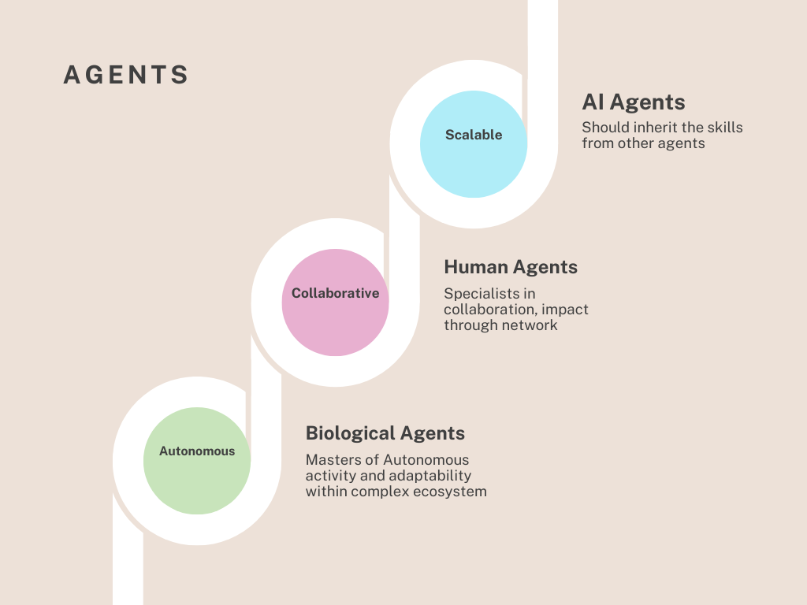

# Agents in Systemic Thinking

Agents are fundamental building blocks of systems, interacting with their environment and contributing to the system's behavior and evolution. This document explores three key types of agents, their roles, and how AI agents can learn from them.

    

## Top 3 Types of Agents

1. **Biological Agents (Natural/Organic)**:
   - **Examples**: Bees (pollination), bacteria/viruses (infection), parasites.
   - **Role**: Operate within ecosystems, influencing biological processes and maintaining balance.
   - **Takeaway**: Efficient, detailed work as part of a larger ecosystem.

2. **Human Agents (Representatives)**:
   - **Examples**: Individual or group of, Real estate agents, insurance agents, travel agents, talent agents.
   - **Role**: Provide expertise, facilitate services, and collaborate effectively to scale operations.
   - **Takeaway**: Collaboration and the ability to expand service offerings over time.

3. **AI Agents (Digital/Software)**:
   - **Examples**: Chatbots, virtual assistants (Siri, Alexa), recommender systems, trading bots.
   - **Role**: Automate tasks, analyze data, interact with users, and assist in decision-making.
   - **Gap**: Current AI agents lack the systemic adaptability and collaborative capabilities seen in bio and human agents.

## Lessons for AI Agents

### Bridging the Gap
AI agents, as defined today, focus on task automation, data analysis, and decision-making. However, they lack:
- **Systemic Adaptability**: The ability to evolve and adapt like biological agents.
- **Collaborative Capabilities**: The ability to scale and work cohesively like human agents.

### Key Takeaway

AI agents we build should combine the strengths of bio and human agents to become:
- **Autonomous**: Operate independently without constant supervision.
- **Collaborative**: Work effectively with humans and other agents.
- **Scalable**: Adapt to various levels of complexity and expand their impact.

In the next section, we’ll explore the strengths that AI agents already possess—and identify the capabilities they still need to fully embody the systemic potential of biological and human agents.

---
**SyntropAI**: Bridging systemic thinking and AI through the lens of agents.

## Next Steps

To continue exploring how AI agents can be empowered to achieve systemic adaptability and collaboration, proceed to the next document:

[Empowered AI Agent README](empowered-ai-agents.md)