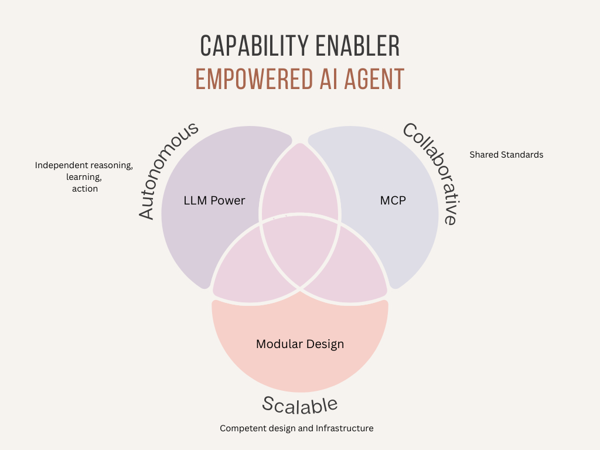

# Empowered AI Agents

Building on the **Key Takeaway** from the [Systemic Thinking Agents README](01_01_systemic-thinking-agents.md):
- AI agents should be **autonomous**, **collaborative**, and **scalable** to fully realize their potential.

    

This document explores how AI agents have already achieved autonomy, how collaboration can be enhanced through protocols, and how scalability can be achieved by deepening our understanding of autonomy.

## Autonomy: "LLM-powered Intelligence"

AI agents have demonstrated single-task autonomy since the early days of robotics and machine learning (ML).

Autonomy remains the foundation for building empowered AI agents, enabling them to function without constant human intervention after humans have effectively designed their intelligence into them, thereby making it distinct for their business—a USP.

## Collaboration: Standards and "Protocols"

Again, like humans collaborate with common language, systems collaborate with common standards and protocols. Model Context Protocol (MCP), introduced by Anthropic in Q4 2024, is a significant first milestone for AI agents to have a commonly recognized collaboration model. Equally competing yet complementary is Google's Agent-to-Agent protocol, introduced in the first week of April.

Let's look at three protocols that changed the IT ecosystem in general, and acknowledge that MCP, A2A, or a new kind will make it to the mainstream:

| Protocol          | Invention Year | Mainstream Adoption       | Description                                                                 |
|--------------------|----------------|---------------------------|-----------------------------------------------------------------------------|
| **TCP/IP**        | 1970s          | 1980s                     | Foundation of the internet, adopted with ARPANET.                          |
| **HTTP**          | 1989           | Mid-1990s                 | Enabled the World Wide Web, introduced by Tim Berners-Lee.                 |
| **SMTP**          | 1982           | 1990s                     | Widely adopted for email communication.                                    |

## Scalability: Scaling up the Autonomy in Agents

Scalability is the natural progression of autonomy. To achieve scalability, we must:
1. **Optimize Autonomous Capabilities**:
   - Ensure agents can handle increasing complexity without performance degradation.

2. **Leverage Infrastructure**:
   - Use robust infrastructure to support distributed and scalable agent operations.

3. **Design Modular Systems**:
   - Build agents with modular architectures to enable seamless integration and scaling.

### Key Takeaway

## Alignment of Core Concepts

| Capability   | Key Enabler                | Description                                  |
|--------------|-----------------------------|----------------------------------------------|
| Autonomy     | LLM-powered Intelligence    | Independent reasoning, learning, and action. |
| Collaboration| Model Context Protocol (MCP)| Shared standards for agent-to-agent communication. |
| Scalability  | Modular Solutions           | Distributed, resilient systems for growth.   |

---

## Next Steps

The next section explains that empowered AI agent ecosystems must be built on three systemic pillars—executive, legislative, and regulatory—mirroring resilient structures in human, biological, and digital systems to ensure scalable, governed, and trustworthy operations.

[Pillars of Systemic AI](01_03_pillars-of-ai.md)

---
**SyntropAI**: Empowering AI agents through systemic thinking and collaboration.
---
