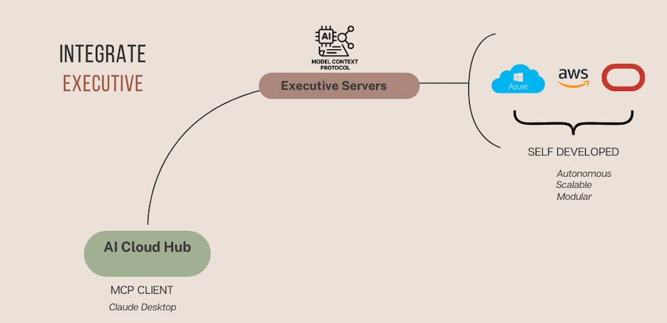

# AI Cloud Hub: Integration of Executive Arm

Building on the **Key Takeaways** from the [AI Cloud Hub: Introduction README](02_01_ai-cloud-hub.md), this section demonstrates the technical integration of Executive Server components into the AI Cloud Hub using the **Model Context Protocol (MCP)**.

These integrations enable AI agents to autonomously manage infrastructure resources across cloud providers (Azure, AWS, OCI), supported by **modular**, **scalable**, and **self-developed** backend services.

---

## Integration Architecture

### Key Components:

- **AI Cloud Hub (MCP Client):**  
  Serves as the entry point for triggering operations via natural language, using an AI interface (e.g., Claude Desktop).

- **Executive Servers:**  
  These agent-accessible services abstract interactions with cloud infrastructure. They are the only **self-developed** servers, designed to avoid hardcoding of any cloud-specific services. Their architecture supports full agnosticism to service changes, additions, or removals, ensuring flexibility and adaptability.
  
  - **Autonomous** — respond dynamically to AI agent prompts  
  - **Scalable** — built to extend to other hyperscalers and on-prem environments  
  - **Modular** — easily integrable across diverse cloud platforms

- **Supported Cloud Platforms:**  
  - Microsoft Azure   
  - Amazon Web Services (AWS) 
  - Oracle Cloud Infrastructure (OCI)

---

## Use Case Demos

Below are short video recordings with audio demonstrating real-world use cases:

| Use Case                                  | Description                                                                 | Video Link         |
|-------------------------------------------|-----------------------------------------------------------------------------|--------------------|
| 🏗️ Azure Resource Group Creation          | Demonstrates agent-driven creation of a resource group within an Azure subscription. The user initiates the task via natural language, and the AI Cloud Hub executes the request autonomously. | [Watch Video](https://youtu.be/fpGlBiCPfQs)     |
| 🌐 Create VNet and Virtual Machine         | Demonstrates creation of a virtual network followed by a virtual machine in Azure, using simple natural language commands. Once provisioned, resource details are retrieved and displayed. | [Watch Video]https://youtu.be/vyh2tDsFTZQ)   |
| 🗑️ List and Delete Azure Resources         | AI agent lists existing Azure resources and deletes them based on user instructions given in plain English, showcasing seamless lifecycle management. | [Watch Video](https://youtu.be/pYViOSI-6e0)   |
| 🗂️ Create Compartment in OCI               | Demonstrates creation of a new compartment in Oracle Cloud Infrastructure (OCI) using a natural language instruction. Highlights how SyntropAI enables straightforward cross-cloud resource provisioning through conversational AI. | [Watch Video](https://youtu.be/yzszDuuTlnU)   |
| 🌐 Deploy Web Server on OCI Ampere VM       | AI agent provisions an OCI compute instance, configures a web server, adjusts network/firewall settings, and validates accessibility — all via simple English instructions. | [Watch Video](https://youtu.be/N12zA4NP0uM)   |
| 🌍 Multilingual and Autonomous Deletion in OCI | Demonstrates the AI agent's ability to process multilingual (German) instructions and autonomously discover, investigate, and safely delete complex infrastructure in OCI. Without prior knowledge of the environment, the agent identifies dependencies, orchestrates safe deletion of components, and removes the VCN safely. | [Watch Video](https://youtu.be/1ZOP1crIRf0)   |
| 🛠️ Autonomous Troubleshooting (Short-Form) | Demonstrates the AI agent’s ability to autonomously troubleshoot a misconfigured web server. A deliberate error is introduced by blocking port 80 via the security list. With no prior context, the agent investigates, identifies the issue, corrects the firewall rule, verifies connectivity, and reports the resolution — all triggered by a simple natural language instruction. This short-form version focuses on rapid results. | [Watch Video](https://youtu.be/MBV0RPa4cco) |
| 🎥 Deep Dive: Long-Form Troubleshooting     | An 8-minute detailed walkthrough showcasing the AI agent’s full troubleshooting process for a misconfigured web server on an OCI VM. Unlike the short-form version, this demo reveals how the agent thinks: it investigates across compartments, adapts to failures, shifts strategies, and ultimately fixes the issue by updating firewall rules and restarting the VM. This highlights the agent’s persistence, reasoning, and human-like problem-solving capabilities. | [Watch Video](https://youtu.be/pwtpNWo_Tno) |
| 🧠 Unified Multi-Hyperscaler Provisioning | Demonstrates how a single natural language instruction can trigger simultaneous provisioning of cloud resources across Azure, AWS, and Oracle Cloud Infrastructure. The AI agent autonomously sets up an Azure App Service, an empty OCI Compute instance, and an S3 bucket in AWS. This showcases the modular, cloud-agnostic design of SyntropAI and its ability to orchestrate infrastructure across hyperscalers — with support extendable to any cloud or on-prem platform built on cloud-native principles. | [Watch Video](https://youtu.be/xbBt7iVlUWM)   |

> 🔗 *Clicking on video links will open them in the same window. Right-click and choose "Open Link in New Tab" for a better experience.*

---

## Key Takeaway

The Executive Arm provides AI agents with the autonomy to act — but not in isolation. Through self-developed, cloud-agnostic services integrated via the Model Context Protocol (MCP), agents can provision, manage, and troubleshoot infrastructure across hyperscalers with natural language inputs.

This operational layer forms the **execution backbone** of SyntropAI — setting the stage for systemic orchestration guided by legislative policy and regulatory oversight in the next section.

---

## Next Steps

Next section explains the integration of the Legislative Arm, focusing on policy enforcement, governance, and operational boundaries.

[AI Cloud Hub: Legislative Arm](03_01_ai-cloud-hub-legislative.md)

---

**SyntropAI**: Turning cloud operations into intelligent, agent-driven execution.
