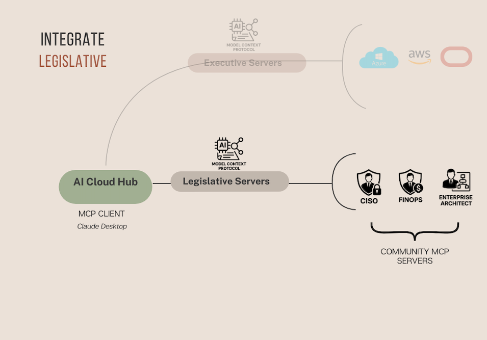

# AI Cloud Hub: Integration of Legislative Arm

Building on the **Executive Arm** integration described in the [AI Cloud Hub: Executive README](02_02_ai-cloud-hub-executive.md), this section introduces the **Legislative Arm** — the system of **policies, constraints, and guidelines** that provide direction and boundaries for AI agents acting across multicloud environments.

Where the Executive Servers act, the Legislative Servers **govern** — defining what is allowed, what must be enforced, and how exceptions are handled.

---

## What This Is

This component demonstrates how **AI-driven policy enforcement** can be embedded into the infrastructure orchestration lifecycle. It reflects the **"Strong yet Simple Legislative Arm"** from the Pillars of Systemic AI.

The legislative layer enables:
- Declarative control without micromanagement,
- Adaptability across providers (OCI, AWS, Azure),
- Alignment with CISO and FinOps best practices.

---

## Integration Architecture

### Key Components

- **AI Cloud Hub (MCP Client):**  
  Serves as the interface for agent instructions, policies, and infrastructure requests. Acts as the central node that orchestrates interactions between executive, legislative, and regulatory components.

- **Legislative Rule Store:**  
  [GitHub Repo](https://github.com/modelcontextprotocol/servers/tree/main/src/filesystem)  
  A file-based rules engine that stores declarative policies. These policies are parsed and applied during agent execution, acting as programmable constraints and governance logic.

- **Knowledge-Memory Servers:**  
  [GitHub Repo](https://github.com/modelcontextprotocol/servers/tree/main/src/memory)  
  Maintain contextual and historical memory for agents. This includes applied policies, previous violations, and organization-wide standards that influence current decisions.

- **Slack Notification Server:**  
  [GitHub Repo](https://github.com/modelcontextprotocol/servers/tree/main/src/slack)  
  Integrates the policy enforcement system with Slack. Routes policy violations, exceptions, and provisioning summaries to designated channels (`#multicloud-orchestrator`, `#ciso-review`, `#finops-alerts`) for human oversight.

---

## Introduced Legislative Knowledge

As part of this exercise, the following **seven policy types** were introduced to shape agent behavior and enforce operational boundaries.

> These policies are maintained in a **simple, human-readable format and grammar** — making them transparent, easy to review, and adaptable by non-technical stakeholders such as CISOs, FinOps teams, and Enterprise Architects.

The policies are defined within the following **rule stores**:

- **CISO Rule Store**: [technical/legislative/ciso-rule-store/rule-book.txt](../technical/legislative/ciso-rule-store/rule-book.txt)  
  Contains security and compliance policies, such as enforcing private subnets and tagging requirements.

- **FinOps Rule Store**: [technical/legislative/finops-rule-store/rule-book.txt](../technical/legislative/finops-rule-store/rule-book.txt)  
  Includes cost governance rules, such as maximum VM configurations and approved regions.

- **Agent Owner Rule Store**: [technical/legislative/owner-rule-store/rule-book.txt](../technical/legislative/agent-rule-store/rule-book.txt)  
  Defines operational rules for agents, such as storing chat context in memory and reporting execution results.

### ✅ Resource Constraints
1. **Approved VM Images**  
   Only images that meet security standards are allowed for provisioning VMs. (See CISO Rule Store)

2. **Maximum VMs per VCN/VPC/VNet**  
   Limits the number of compute instances per virtual network to avoid cost explosion and shadow infrastructure. (See FinOps Rule Store)

3. **Region Restrictions**  
   Resources may only be provisioned in approved regions (e.g., Switzerland North, eu-frankfurt-1, us-west-2) for data residency and latency control. (See FinOps Rule Store)

4. **Enforce Private Subnets for Data Resources**  
   All data-related resources (e.g., storage buckets, databases) must be deployed in private subnets only. (See CISO Rule Store)

### ✅ Governance & Reporting
5. **Mandatory Tagging**  
   All resources must be tagged with owner, cost center, and lifecycle metadata. (See CISO Rule Store)

6. **Violation Reporting**  
   Any failure to adhere to policies results in a structured violation message, passed to the Slack channel for alerting and review. (See Agent Owner Rule Store)

7. **Resource Reporting**  
   All created resources are logged and summarized in Slack for visibility across stakeholders (e.g., IT Ops, Security, Finance). (See Agent Owner Rule Store)

---

## Exception Handling Mechanism

Exceptions to any of the above rules are **not silently ignored**. Instead, they are channeled into a multi-tenant Slack workspace with the following channels:

| Channel | Audience | Purpose |
|--------|----------|---------|
| `#multicloud-orchestrator` | General ops and architecture team | Receives all general events, provisioning results, and high-level alerts. |
| `#ciso-review`             | Security and compliance stakeholders | Receives security-related violations (e.g., public subnet for data, image not approved). |
| `#finops-alerts`           | Finance and cost governance team | Receives budget policy breaches, excessive VM provisioning, and missing cost tags. |

Slack integration ensures **human-in-the-loop governance**, keeping agents autonomous but **auditable and accountable**.

---

## Legislative Server Role in MCP Ecosystem

The **Legislative Server** sits between Executive action and Regulatory memory. It:

- **Interprets policies** before an agent executes a task.
- **Injects constraints** into agent reasoning (e.g., “You may not use an unapproved image”).
- **Communicates violations** back to human stakeholders in real-time.

---

## Use Case Demos

Below are short videos demonstrating how AI agents interact with policy rules during infrastructure orchestration:

| Use Case                                        | Description                                                                                                             | Video Link         |
|-------------------------------------------------|-------------------------------------------------------------------------------------------------------------------------|--------------------|
| 🧠 Policy-Compliant Multicloud Provisioning | Demonstrates the AI agent provisioning infrastructure across Oracle Cloud and Azure, while adhering to predefined policies from CISO, FinOps, and Owner rulebooks. The agent selects approved images, enforces tagging, deploys only in permitted regions, uses private subnets for sensitive workloads, and communicates all activity to designated Slack channels. | [Watch Video](https://drive.google.com/file/d/1JmhS7245dc6KKH7Tmr3EPJL0jYPFfMu8/view?usp=sharing) |
| ⚖️ Exception-Driven Multicloud Provisioning | Demonstrates the AI agent handling a region-based policy conflict during a multicloud provisioning request (OCI Ashburn & Azure Germany). Instead of executing blindly, the agent consults its governance memory, detects non-compliant regions, and escalates the exception via Slack to `#CISO-approval`. Upon approval, it proceeds with full traceability, tagging, and audit logging — showcasing explainable, governed orchestration. | [Watch Video](https://drive.google.com/file/d/1xSZrMNU0f5DVZ39-fX9IRZsqsbKfEy7U/view?usp=sharing) |

---

## Key Takeaway

Legislation provides the essential **guardrails** for autonomous Executive AI agents.  
With these guardrails in place, autonomy becomes aligned with business strategy, security policies, and operational priorities.

This README has demonstrated how **legislative knowledge and policy enforcement** can be modeled, integrated, and operationalized within real-world AI agent systems.

---

## Next Steps

Next section describes the integration of the Regulatory Arm, emphasizing oversight, accountability, and continuous improvement.

[AI Cloud Hub: Regulatory Arm](04_01_ai-cloud-hub-regulator.md)

---

**SyntropAI**: Governing AI-powered infrastructure through policy-driven systemic thinking.
