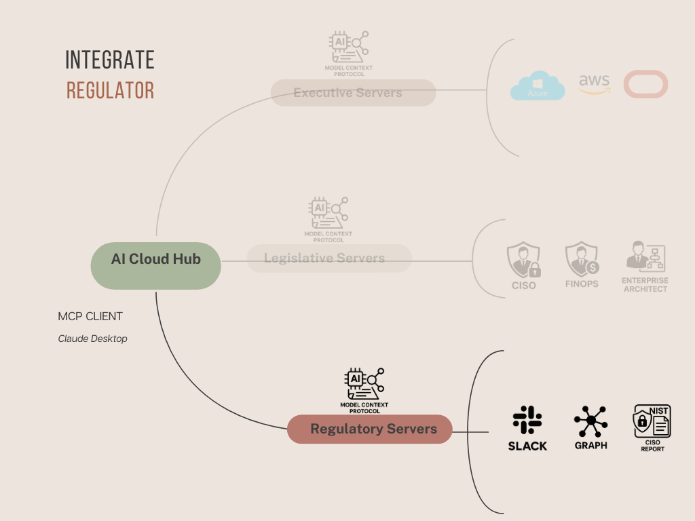

# AI Cloud Hub: Integration of Regulatory Arm

Building on the **Legislative Arm** detailed in the [AI Cloud Hub: Legislative README](ai-cloud-hub-legislative.md), this section introduces the **Regulatory Arm** — the layer of oversight, memory, and accountability that ensures AI agents operate within observable and trustworthy boundaries.

Where the Executive Servers act and the Legislative Servers guide, the **Regulatory Servers verify, record, and report** — closing the loop on explainability, compliance, and systemic assurance.

---

## What This Is

This component realizes the **“Competent and Trust-Building Regulatory Arm”** described in the [Pillars of Systemic AI README](pillars-of-ai.md).

It enables:
- **Shared memory and traceability** across executions,
- **Policy and behavior observability**,
- **Real-time communication and reporting** to human stakeholders.

This ensures that autonomy remains auditable, and that operations align with evolving enterprise trust models.

---

## Integration Architecture

### Key Components

- **AI Cloud Hub (MCP Client):**  
  Interfaces with users through natural language and routes context to all server arms.

- **Regulatory Servers:**  
  
  These servers act as the **system’s conscience** — responsible for persistent memory, observability, reporting, and trace validation across all AI agent actions. They support:
  
  - **SLACK Integration** — for real-time human-in-the-loop monitoring, we touched base on this in Legislative Arm
  - **GRAPH Memory** — for mapping dependencies, agent behaviors, and audit trails  
  - **CISO Report Layer** — generates structured, NIST-aligned compliance and policy adherence summaries

---

## Focus Area: Experimental Regulatory Capabilities

While many internal and external regulations must eventually be addressed, this exercise focuses on three **early-stage regulatory features** — each designed to demonstrate how AI agents can align with key areas of observability, reproducibility, and governance.

### 💸 1. Cost Oversight and FinOps Monitoring

The Regulatory Arm monitors resource creation in coordination with FinOps policies. All cost-affecting actions are:
- Logged to Slack (`#finops-alerts`)
- Traced to their initiating request
- Evaluated against predefined VM, region, and tag-based cost thresholds

This forms the foundation for cost observability in future budget compliance workflows.

### 🔗 2. Resource Graph Memory for State Reproducibility

A real-time **resource graph** is built and maintained, capturing:
- All provisioned components
- Their relationships and dependencies
- Timestamps, tags, and ownership lineage

This enables agents (and humans) to:
- Understand current infrastructure state
- Reproduce identical deployments if needed
- Trace failures or regressions to specific actions

### 🛡️ 3. Experimental NIST OSCAL Reporting

A prototype generator produces **NIST OSCAL-aligned reports** for each infrastructure provisioning event.  
These reports offer a compliance narrative for CISOs, showing:
- Which policies were evaluated
- Which were violated or overridden
- Who approved exceptions, and when

Though experimental, this demonstrates how **compliance as code** can evolve into **compliance as knowledge** — traceable, explainable, and actionable.

> These features are early-stage but foundational — laying the groundwork for deeper regulatory intelligence and audit-readiness within the AI Cloud Hub.

---

## Example Use Cases

| Use Case                               | Description                                                                                                   | Video Link |
|----------------------------------------|---------------------------------------------------------------------------------------------------------------|------------|
| 📊 Compliance Summary Reporting        | Agent provisions cloud resources and submits a NIST-style compliance report to CISO and Ops via Slack.        | [Watch Video](https://example.com/demo3) |
| 🧠 Memory Recall for Previous Actions  | Agent queries its own memory to trace when, why, and by whom a specific VM was provisioned.                   | [Watch Video](https://example.com/demo4) |
| 🛡️ Policy Violation Insight           | When a rule is breached, the Regulatory Server auto-tags the violation, logs the incident, and alerts Slack. | [Watch Video](https://example.com/demo5) |

---

## Regulatory Server Role in MCP Ecosystem

The Regulatory Arm acts as the **feedback loop** for the system:

- **Listens to** all actions taken by the Executive Arm  
- **Validates compliance** with Legislative constraints  
- **Captures context**, stores history, and **generates structured reports**

By embedding regulatory intelligence into the AI Cloud Hub, SyntropAI ensures **autonomy with accountability**, and **execution with explainability**.

---

## Key Takeaway

The Regulatory Arm transforms operational transparency from an afterthought into a design principle.  
It empowers AI agents to be not only effective and compliant — but also trustworthy, reviewable, and self-aware.

In the next section, we’ll explore how these three arms come together through a working prototype of the **AI Cloud Hub**.

---

**SyntropAI**: Building systemic trust into AI orchestration through memory, monitoring, and reporting.
