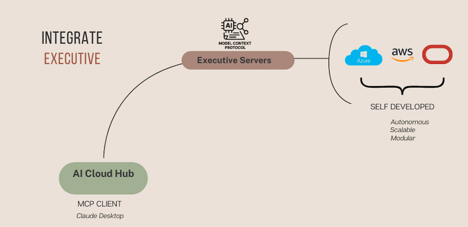

# AI Cloud Hub: Integration of Executive Arm

Building on the **Key Takeaways** from the [AI Cloud Hub: Introduction README](ai-cloud-hub.md), this section demonstrates the technical integration of Executive Server components into the AI Cloud Hub using the **Model Context Protocol (MCP)**.

These integrations enable AI agents to autonomously manage infrastructure resources across cloud providers (Azure, AWS, OCI), supported by **modular**, **scalable**, and **self-developed** backend services.

---

## Integration Architecture

### Key Components:

- **AI Cloud Hub (MCP Client):**  
  Serves as the entry point for triggering operations via natural language, using an AI interface (e.g., Claude Desktop).

- **Executive Servers:**  
  These agent-accessible services abstract interactions with cloud infrastructure. They are the only **self-developed** servers, designed to avoid hardcoding of any cloud-specific services. Their architecture supports full agnosticism to service changes, additions, or removals, ensuring flexibility and adaptability.
  
  - **Autonomous** — respond dynamically to AI agent prompts  
  - **Scalable** — built to extend to other hyperscalers and on-prem environments  
  - **Modular** — easily integrable across diverse cloud platforms

- **Supported Cloud Platforms:**  
  - Microsoft Azure  
  - Amazon Web Services (AWS)  
  - Oracle Cloud Infrastructure (OCI)

---

## Use Case Demos

Below are short video recordings demonstrating real-world use cases:

| Use Case                                  | Description                                                  | Link                |
|-------------------------------------------|--------------------------------------------------------------|---------------------|
| 🔁 Resource Creation via Claude Agent     | Create a new VM on Azure using an AI agent prompt            | [Watch Video](#)    |
| 🔍 Real-time Cloud Inventory Lookup       | AI agent queries and lists resources across multicloud       | [Watch Video](#)    |
| 🛡️ Apply Security Guardrails (CISO rules) | Enforce least-privilege access and tagging standards         | [Watch Video](#)    |

> 🎥 *Videos are hosted on the internal demo portal or shared via secure link.*

---

## Next Steps

In the next section, we’ll explore the **Legislative Arm**, where governance, security, and financial rules are embedded as contextual constraints for AI agents.

---
