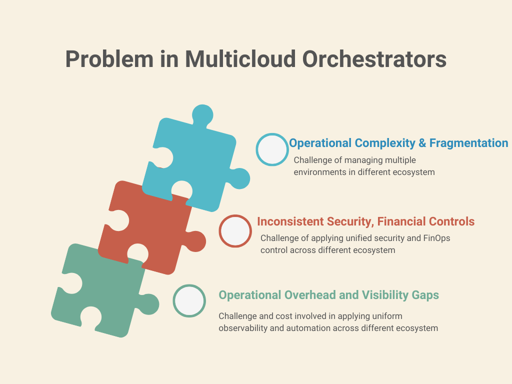

# AI Cloud Hub: Introduction

Building on the **Key Takeaways** from the [Pillars of AI README](pillars-of-ai.md), this syntropAI applies those concepts to a real-world business case through **organic experimentation and system thinking**.

## What This Is *Not*

- Not a checklist of tools or platforms.
- Not a showcase or marketplace of technologies.

## What This *Is*

An exploratory initiative demonstrating how **AI agents** can solve a **complete value chain** problem in a hybrid and multicloud environment.  
It features:
- Purpose-built engineering components (created, adapted using AI, and out-of-the-box tools from marketplaces),
- Select integrations with cloud-native tools where needed,
- A system-level design focused on **business relevance and operational outcomes**.

---

## Problem Statement

In hybrid and multicloud environments, IT organizations face growing challenges in achieving operational efficiency, financial governance, and resilience across complex, distributed infrastructures.

    

### Key Challenges:

- **Operational Complexity and Fragmentation**  
  Diverse cloud platforms and on-prem systems bring inconsistent processes, SLAs, and vendor dependencies — making governance, integration, and service delivery increasingly difficult.

- **Inconsistent Security, Compliance, and Financial Controls**  
  Applying unified policies across clouds and private infrastructure is hard. This leads to increased operational risk, regulatory exposure, budget unpredictability, and poor alignment between IT investments and business outcomes.

- **Operational Overhead and Visibility Gaps**  
  Without unified observability and automation, monitoring and optimizing workloads becomes inefficient — increasing downtime risk and reducing service quality.

---

## Vision Statement

The **AI Cloud Hub** aims to centralize infrastructure and platform operations across hybrid and multicloud environments — using **AI agents** to bring:

    

- **Operational Excellence** (through intelligent automation and collaboration),
- **Security & Risk Alignment** (with CISO-led best practices),
- **Cost Efficiency** (via FinOps principles)

The goal is to build a **Unified Operations Hub** — enabling IT, security, finance, and operations teams to:

- Run agent-driven workflows that handle execution and complexity,
- Gain end-to-end visibility across environments,
- Improve governance with unified models.

---

## Foundational Principle/Solution approach

At the core of AI Cloud Hub lies a principled systems approach. The following foundational principles and strategy elements guide both the design and implementation of agents, tools, and workflows:

    

| **Principle**         | **Strategy Element**                              |
|-----------------------|---------------------------------------------------|
| **Contextual Memory** | Persistent knowledge graph                        |
| **Composability**     | Tool & agent plugins with defined schema          |
| **LLM Augmentation**  | Hybrid model-memory reasoning                     |

---

## General Architecture

The architecture of **AI Cloud Hub** is structured around the separation of concerns through three core server types — **Executive**, **Legislative**, and **Regulatory** — all coordinated via a **Model Context Protocol (MCP)** to enable intelligent AI agent interactions across environments.

### Components:

The architecture of the **AI Cloud Hub** is designed to enable seamless collaboration between AI agents and cloud platforms. It ensures operational efficiency, governance, and scalability through a modular and systemic approach.

    

- **AI Cloud Hub**  
  Acts as the central orchestration layer, enabling connectivity, governance, and decision-making across the infrastructure estate using AI agents.

- **Executive Servers**  
  Interact directly with cloud platforms such as **Azure**, **AWS**, and **OCI**, allowing read/write/update operations on platform and infrastructure resources. These servers abstract provider-specific APIs behind agent-aware interfaces.

- **Legislative Servers**  
  Encode **policies and guardrails** based on inputs from **CISO**, **FinOps**, and **Enterprise Architects**. These define how AI agents must operate within organizational rules, ensuring security, compliance, and fiscal discipline.

- **Regulatory Servers**  
  Provide **contextual memory**, **graph-based knowledge**, and **reporting** capabilities. These components ensure agents have access to shared knowledge, relationship mappings, and produce auditable insights.

### Model Context Protocol (MCP)

Each server tier communicates through the **Model Context Protocol**, which enables:

- **Autonomy** — Agents operate independently within defined boundaries,
- **Scalability** — Components and agents scale horizontally across environments,
- **Modularity** — Functions are decoupled, enabling flexible integration and composability.

---

**SyntropAI**: From concept to real-world impact — solving multicloud complexity through systemic AI agent design.
