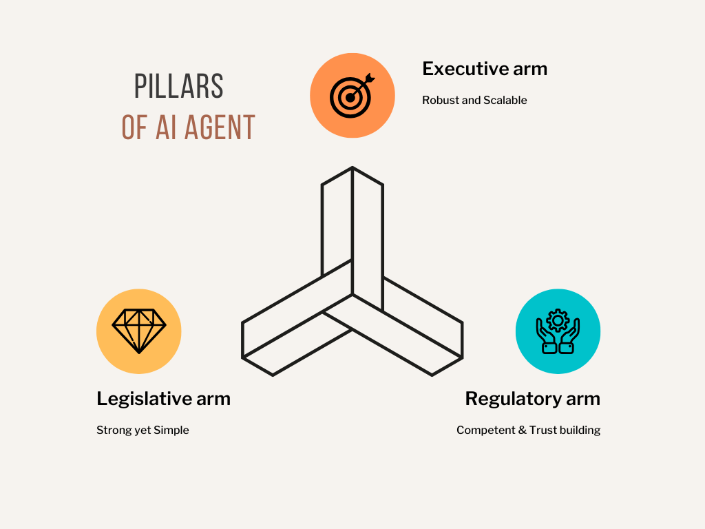

# Pillars of Systemic AI

Building on the **Key Takeaway** from the [Empowered AI Agents README](empowered-ai-agents.md):

Just as countries, organizations, and IT systems rely on foundational pillars for their success, empowered AI agent ecosystems must also be built on the same systemic principles.

To enable sustainable success, every resilient system—whether biological, human, or digital—requires three enduring pillars:

    

## The Three Foundational Pillars

1. **Robust and Scalable Executive Arm**  
   Drives efficient, resilient action across diverse and evolving environments, ensuring that agents can operate autonomously at scale.

2. **Strong yet Simple Legislative Arm**  
   Defines clear, enforceable policies and frameworks, maintaining governance.

3. **Competent and Trust-Building Regulatory Arm**  
   Ensures systemic integrity, accountability, and operational excellence through transparent oversight, validation, and continuous improvement.

---

These three pillars are not optional; they are essential.  
They transform AI agents from isolated performers into systemic contributors—capable of thriving in multicloud, multi-agent environments where complexity and collaboration are the norm.

In the next section, we will explore how these pillars can be practically embedded into AI agent architecture—beginning with the **AI Executive Layer**.

Building on the **Key Takeaway** from the [Empowered AI Agents README](empowered-ai-agents.md):, we explored the capabilities and enablers for empowered AI agents, recognize that capabilities alone are not enough.

To build truly systemic AI ecosystems whether in countries, organizations, or IT systems—we must establish three foundational pillars that enable sustainable success:

For any system be it Country, Organization, IT system, the building block that can make the system success are 3 pillars

Robust and Scalable Executive Arm:
Drives efficient and resilient actions across diverse environments.

Strong yet Simple Legislative Arm:
Defines clear, enforceable policies and guidelines without unnecessary complexity.

Competent and Trust-Building Regulatory Arm:
Ensures integrity, accountability, and operational excellence through oversight and validation.

- AI agents should be **autonomous**, **collaborative**, and **scalable** to fully realize their potential.

Now with the concepts set, being mindful of the Context, this section dives into embracing experimentation, because "Show, not only Tell" is important.

With AI Agents empowered, the modern AI Agents have:

Robust and Scalable Executive Arm:
Drives efficient and resilient actions across diverse environments.

Strong yet Simple Legislative Arm:
Defines clear, enforceable policies and guidelines without unnecessary complexity.

Competent and Trust-Building Regulatory Arm:
Ensures integrity, accountability, and operational excellence through oversight and validation.

Building on the systemic thinking principles outlined in the **Empowered AI Agents** framework, the **Multicloud Platform Provisioner** embodies the key takeaways of autonomy, collaboration, and scalability. By leveraging these principles, the Provisioner ensures robust, adaptive, and efficient multicloud provisioning.

- **Autonomy**: Each component (Executor, Legislator, Regulator) operates independently while contributing to the overall system's goals.
- **Collaboration**: Components interact seamlessly using shared protocols and data structures, ensuring efficient and secure operations.
- **Scalability**: The modular design and use of MCP servers ensure the system can scale to accommodate increasing complexity and workloads.

---

The **Multicloud Platform Provisioner** is a tool designed to simplify the provisioning of infrastructure, platforms, and services across multiple cloud providers (Azure, AWS, and OCI). It is built with modular components to ensure flexibility, scalability, and adaptability to changes in cloud service catalogs.

## Use Cases

### 1. Infrastructure/Cloud Architects
- **Objective**: Design and provision complex multicloud architectures.
- **How**: Use the Provisioner to simplify and standardize resource provisioning across Azure, AWS, and OCI.

### 2. DevOps Engineers
- **Objective**: Automate and streamline resource provisioning across hyperscalers.
- **How**: Leverage the Provisioner to execute repeatable workflows and ensure compliance with organizational standards.

---

## Components

### 1. Executor
- **Purpose**: Provisions infrastructure, platforms, and services across Azure, AWS, and OCI.
- **Key Features**:
  - Supports all services offered by hyperscalers without hardcoding.
  - Agnostic to changes in service catalogs or parameter updates.
  - Leverages Python SDK libraries for each cloud provider.

### 2. Legislator
- **Purpose**: Provides security guidelines and ensures compliance.
- **Key Features**:
  - Stores security rules and FinOps rules in a dedicated file system server.
  - Ensures adherence to organizational and regulatory standards.

### 3. Regulator
- **Purpose**: Captures execution information for analysis and repeatability.
- **Key Features**:
  - Logs execution details for auditing and troubleshooting.
  - Enables repeatable provisioning workflows.

## Building Blocks

The **Provisioner** is built on the following foundational servers:

1. **MCP Servers**:
   - Self-built MCP servers for Azure, AWS, and OCI.
   - Leverage Python SDK libraries to interact with hyperscalers.
   - Fully agnostic to changes in service catalogs or parameters.

2. **MCP SSH Server**:
   - Facilitates secure communication and execution.

3. **File System Server**:
   - Base for storing security rules and FinOps rules.
   - Used by the Legislator component.

4. **Graph Server**:
   - Stores the Infrastructure-as-Code (IaC) representations of hyperscaler resources.
   - Enables visualization and management of provisioned resources.

5. **Memory Server**:
   - Stores conversation context for prompt-based provisioning.

---
**SyntropAI**: Simplifying multicloud provisioning through innovation and systemic thinking.
