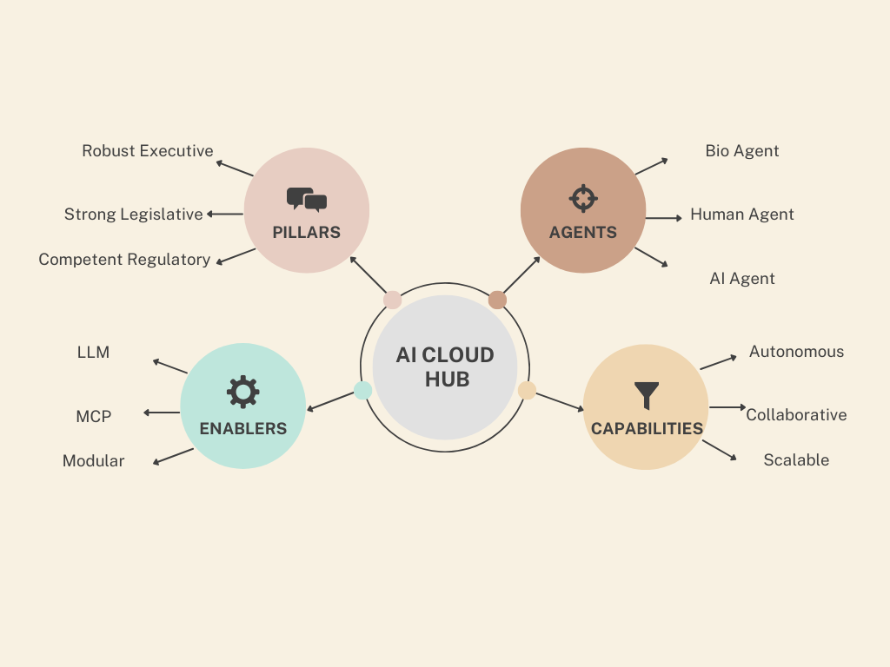

# Pillars of Systemic AI

Building on the **Key Takeaway** from the [Empowered AI Agents README](empowered-ai-agents.md):

Just as countries, organizations, and IT systems rely on foundational pillars for their success, empowered AI agent ecosystems must also be built on the same systemic principles.

To enable sustainable success, every resilient system—whether biological, human, or digital—requires three enduring pillars:

    

## The Three Foundational Pillars

1. **Robust and Scalable Executive Arm**  
   Drives efficient, resilient action across diverse and evolving environments, ensuring that agents can operate autonomously at scale.

2. **Strong yet Simple Legislative Arm**  
   Defines clear, enforceable policies and frameworks, maintaining governance.

3. **Competent and Trust-Building Regulatory Arm**  
   Ensures systemic integrity, accountability, and operational excellence through transparent oversight, validation, and continuous improvement.

### Key Takeaway

The three-part conceptual series — **"Agents in Systemic Thinking," "Empowered AI Agents,"** and **"Pillars of Systemic AI"** — establishes a foundational background in systemic thinking and design thinking for AI agent ecosystems.

One of the pioneers of Design Thinking, the Hasso Plattner Institute of Design at Stanford (celebrating its centenary soon), identifies seven core mindsets for innovation. The first among them is "Show, Don't Tell" — or in modern adaptation, "Show and Tell."

Embracing this mindset, SyntropAI will now move beyond conceptual frameworks into **experimentation** — demonstrating how AI agents can address business challenges:  
- Some that were previously unsolvable,  
- Others that can now be approached in fundamentally new ways.

This transition marks the beginning of the next phase: moving from theory to practice, guided by systemic thinking and design-driven innovation.

The following diagram provides an overview of this next stage.

    

---
**SyntropAI**: Simplifying multicloud provisioning through innovation and systemic thinking.

